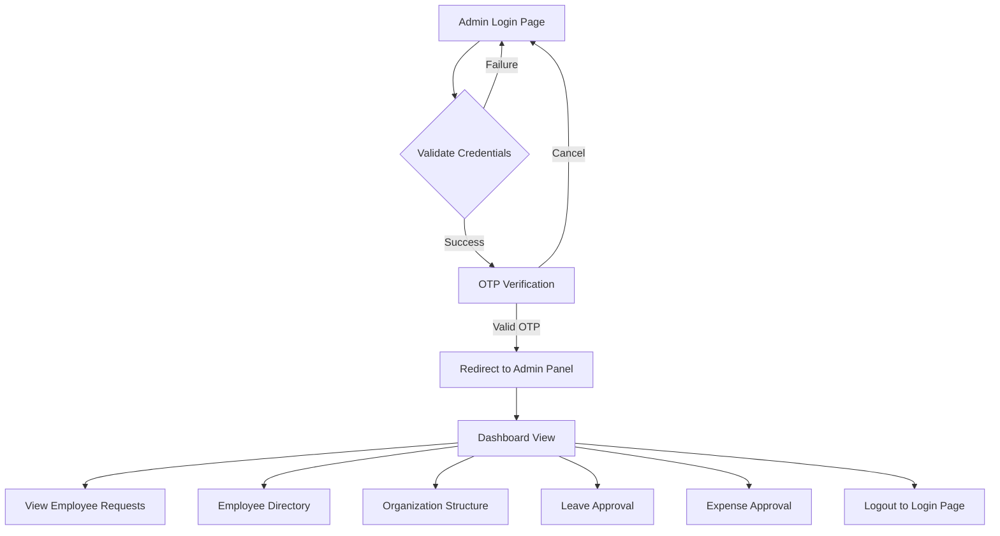

# WorkNest Employee Management System

---

## 1. Project Overview

**WorkNest** is a comprehensive Employee Management System designed for small to medium-sized businesses. It streamlines administrative tasks related to employee registration, leave management, payroll, organization structure, and expense reimbursements. The system supports two interfaces:

* **Admin Interface**: For managing and overseeing organizational and employee-level operations.
* **Employee Interface**: For employee profile management, leave application, and payslip access.

---

## 2. Technologies Used

* **Backend**: Java, Spring Boot
* **Frontend**: Thymeleaf (HTML/CSS), JavaScript
* **Database**: PostgreSQL
* **Server**: Apache Tomcat
* **IDE**: VS Code
* **Version Control**: Git & GitHub

---

## 3. Key Features Implemented

### A. Admin Login Flow

* Admin logs in with:

  * Admin ID
  * Organization Code
  * Password
* On successful validation, an OTP is sent to the registered mobile number.
* Admin enters OTP for verification.
* Upon verification, the admin is redirected to the **Admin Dashboard Panel**.

### B. Admin Panel

The admin panel includes:

1. **Dashboard Landing Page**

   * Welcome message
   * Upcoming holidays
   * Key statistics (Employees, Pending Requests, Leaves)

2. **Sidebar Functionalities**

   * Dashboard
   * Employee Requests
   * Employee Directory
   * Organization Structure
   * Leave Approvals
   * Expense Approvals
   * Reports

3. **Top Navigation Bar**

   * Company Details | Admin Panel
   * Profile | Settings | Logout

### C. Employee Account Request

* Admin receives registration requests.
* Admin can approve or request changes with feedback.

### D. Organization-Specific DB Handling

* Each organization has a unique org code.
* Org code maps to a specific database for employee data.

---

## 4. File Structure (Spring Boot Project)

```
employee-management/
├── src/
│   ├── main/
│   │   ├── java/
│   │   │   └── com/worknest/...
│   │   └── resources/
│   │       ├── static/
│   │       │   └── css/style.css
│   │       └── templates/
│   │           ├── admin/login.html
│   │           └── admin/panel.html
├── pom.xml
└── ...
```

---

## 5. User Flow Diagram



---

## 6. Git & Deployment

* The project is tracked with Git.
* `.gitignore` is configured to avoid unnecessary files.
* The project is pushed to GitHub using standard Git commands.

---

## 7. Next Steps

* Implement actual DB operations for employee approval.
* Add feedback mechanism.
* Create fully functional employee interface.
* Integrate payroll management.
* Add report generation features.

---

## 8. Local Setup & Configuration Guide

This guide will walk you through setting up the **WorkNest Employee Management System** on your local development machine.

### Step 1: Prerequisites

Ensure the following are installed on your system:

* **Java JDK 17+**
* **Maven**
* **PostgreSQL**
* **Git**
* **VS Code (or any preferred IDE)**
* **Apache Tomcat (optional for manual deployment)**

### Step 2: Clone the Repository

```bash
git clone https://github.com/your-username/employee-management.git
cd employee-management
```

### Step 3: Configure PostgreSQL Database

1. Open PostgreSQL and create a new database, e.g., `worknest_main`.
2. Create separate databases for each organization as needed, e.g.,

   * `worknest_org101`
   * `worknest_org102`
3. Add user credentials (e.g., `postgres`/`your-password`) with access to these databases.
4. Sample `application.properties` (edit accordingly):

```properties
spring.datasource.url=jdbc:postgresql://localhost:5432/worknest_main
spring.datasource.username=postgres
spring.datasource.password=your-password

spring.jpa.hibernate.ddl-auto=update
spring.jpa.show-sql=true

spring.thymeleaf.cache=false
```

### Step 4: Open Project in VS Code

1. Launch VS Code.
2. Open the cloned project folder.
3. Ensure required extensions (Java, Spring Boot, Maven, etc.) are installed.

### Step 5: Build & Run

You can run the Spring Boot application via:

```bash
./mvnw spring-boot:run
```

Or directly in VS Code by:

* Opening `EmployeeManagementApplication.java`
* Clicking the **Run** button.

### Step 6: Access the App

* **Admin Login**:
  Visit: `http://localhost:8080/admin/login`

* **Admin Dashboard Panel** (after login and OTP verification):
  `http://localhost:8080/admin/panel`

### Step 7: Static Resources & Templates

Ensure the following files are placed correctly:

* `src/main/resources/static/css/style.css` – for global styles
* `src/main/resources/templates/admin/login.html`
* `src/main/resources/templates/admin/panel.html`

### Step 8: Optional - Deploy to Tomcat

If you're not using the embedded Spring Boot server:

1. Package the app:

   ```bash
   ./mvnw clean package
   ```

2. Copy the `target/employee-management.war` to your Tomcat's `webapps/` directory.

3. Start Tomcat and access the app at:
   `http://localhost:8080/employee-management`

### Step 9: Git Workflow

* Add and commit your changes:

  ```bash
  git add .
  git commit -m "Your message"
  ```

* Push to GitHub:

  ```bash
  git push origin main
  ```

---

*This document will be continuously updated as development progresses.*
